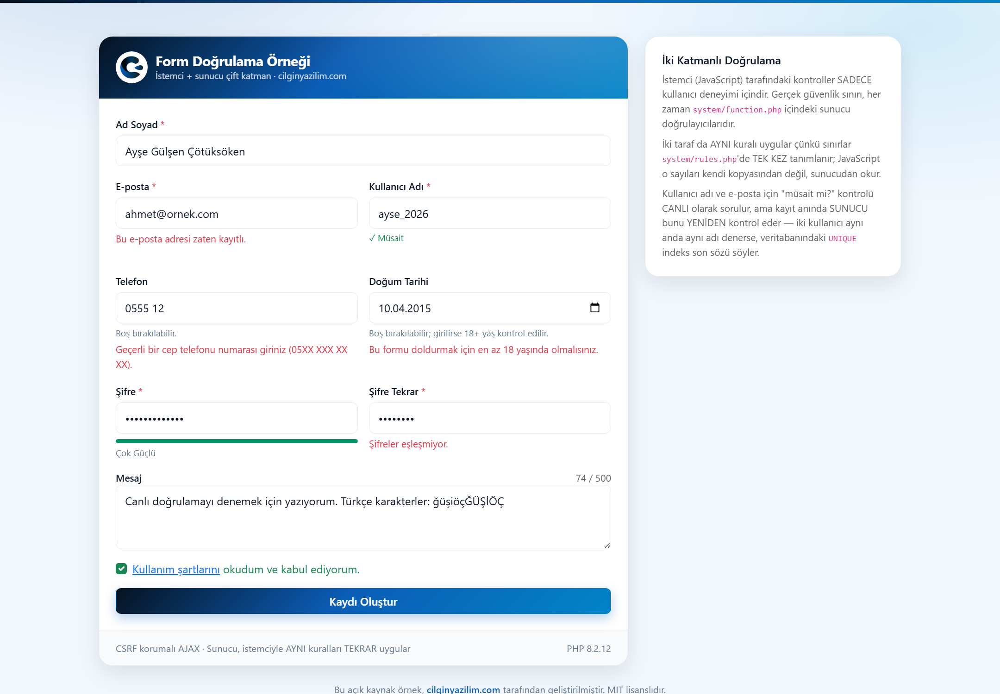

<div align="center">


# Form Doğrulama Örneği

**İstemci + sunucu çift katmanlı form doğrulama — kurallar tek kaynaktan.**
Canlı geri bildirim · Şifre gücü ölçer · AJAX benzersizlik kontrolü · TOCTOU zinciri

[](https://github.com/CilginYazilim/form-validation-example/releases/latest)
[](https://www.php.net/)
[](https://www.mysql.com/)
[](LICENSE)

[cilginyazilim.com](https://cilginyazilim.com) &nbsp;·&nbsp; **Türkçe** | [English](README.en.md)

</div>

---

<div align="center">



<sub>Tek karede projenin tamamı: e-posta <b>canlı olarak</b> sorulup “zaten kayıtlı” dönmüş,<br>
kullanıcı adının altında yeşil <b>“✓ Müsait”</b>, şifre ölçeri <b>“Çok Güçlü”</b>, telefon ve doğum tarihi<br>
kırmızı ve <b>gerekçeli</b>. Form, siz yazarken cevap veriyor.</sub>

</div>

---

## Bu proje ne yapıyor?

Dokuz alanlı bir kayıt formu. Her alan hem **anında** (JavaScript, kullanıcı deneyimi için) hem de **sunucuda** (PHP, güvenlik sınırı olarak) doğrulanır. Kullanıcı adı ve e-posta için “müsait mi?” sorusu, yazarken CANLI olarak sorulur.

Ama projenin anlattığı asıl şey bir form değil, formun altındaki üç soru:

> 1. İstemci doğrulaması neden **güvenlik değildir**, sunucu doğrulaması neden **tek sınırdır**?
> 2. Aynı kural iki dilde iki kez yazıldığında ne olur — ve bu **yapısal olarak** nasıl çözülür?
> 3. “Bu kullanıcı adı müsait” cevabı ne zaman **yalan** olur, ve bu yalan hangi katmanda yakalanır?

---

## 1. Altın kural: istemci doğrulaması güvenlik değildir

> Tarayıcıdaki hiçbir kontrol güvenlik önlemi değildir.

Bu bir slogan değil, ölçülebilir bir gerçektir. Tarayıcı konsolunu açıp `CyValidation` nesnesini silebilir, `assets/js/validation.js` dosyasını hiç yüklemeyebilir ya da formu hiç açmadan doğrudan `system/ajax.php`'ye istek atabilirsiniz. Bu depoda tam olarak bu yapıldı — JavaScript hiç çalıştırılmadan, kabuktan doğrudan POST edildi:

```
POST system/ajax.php
  full_name=x  email=gecersiz  username=1KOTU
  password=kisa  password_confirm=baska
  birth_date=2030-13-45  terms=0

→ HTTP 422
  errors: full_name, email, username, password,
          password_confirm, birth_date, terms
→ Oluşan kayıt: 0
```

**İstemci tarafı ne için var öyleyse?** Kullanıcının hatayı görmek için sayfanın yenilenmesini beklememesi için. Tek işlevi budur ve bu değersiz bir işlev değildir — ama güvenlikle hiçbir ilgisi yoktur.

**Sunucu tarafı neden tek sınırdır?** Çünkü saldırganın kontrol edemediği tek yer orasıdır. Tarayıcıdaki kod kullanıcının makinesinde, kullanıcının denetiminde çalışır; kural koyduğunuz yer, kuralı uygulayan taraf değildir.

---

## 2. İki dilde tek kural: ayrışma sorunu ve yapısal çözümü

Bu projenin en öğretici mühendislik kararı burasıdır.

### Sorun ölçüldü

Eski sürümde her JavaScript doğrulayıcısının üstünde `// bkz. function.php validate_email()` gibi bir yorum vardı. Yani “bu iki liste aynı olmalı” **yorumla** söylenmişti. Yorum derlenmez, test edilmez, kırılmaz. Sonuç, gerçek formu tarayıcıda sürerek ölçüldü:

| Girdi | Sunucu | İstemci | Sonuç |
|-------|--------|---------|-------|
| E-posta, 191 karakter | ❌ reddetti | ✅ **kabul etti** | Kullanıcı formu gönderiyor, sunucudan hata yiyor |
| Şifre, 73 karakter | ❌ reddetti | ✅ **kabul etti** | Aynı |
| Mesaj, 495 harf + 20 boşluk | ✅ kabul etti | ❌ **reddetti** | Geçerli girdi istemcide engelleniyor |
| Ad soyad, 60 astral harf | ✅ kabul etti | ❌ **reddetti** | Aynı (`.length` yüzeyde 120 sayıyor) |
| Kullanıcı adı `"şş"` | “desen hatası” | “uzunluk hatası” | **Aynı girdiye iki farklı gerekçe** |
| Kullanıcı adı `"şşşşşşşşşşş"` | “uzunluk hatası” | “desen hatası” | Aynı, ters yönde |

Bu iki sınırın (190 / 72) istemcide **hiç yazılmamış** olması bir dikkatsizlik değil, **kaçınılmaz bir sonuçtur**: aynı bilgi iki yerde tutulduğu her yerde, zamanla ayrışır.

### Çözüm: sınırları VERİ hâline getirmek

Sayısal sınırlar, desenler ve hata mesajları artık **[`system/rules.php`](system/rules.php)** içinde **bir kez** tanımlanır:

```php
'password' => [
    'required' => true,
    'min'      => 8,
    'max'      => 72,                                   // bcrypt'in sert sınırı
    'pattern'  => '^(?=.*[a-z])(?=.*[A-Z])(?=.*\d).+$',
    'messages' => [
        'length'  => 'Şifre en az {min} karakter olmalıdır.',
        'max'     => 'Şifre en fazla {max} karakter olabilir.',
        'pattern' => 'Şifre en az bir büyük harf, bir küçük harf ve bir rakam içermelidir.',
    ],
],
```

* **PHP** doğrulayıcıları bu diziyi `rule_check()` üzerinden okur.
* **`index.php`** aynı diziyi `client_rules()` ile JSON'a çevirip sayfaya gömer.
* **`validation.js`** o JSON'u okur. Dosyada `72`, `190`, `100` gibi **tek bir sayı bile yazılı değildir**.
* **HTML `maxlength`** değerleri de aynı diziden basılır — yani aynı sınırın üçüncü bir elle yazılmış kopyası da yok.

### Bağlantının kanıtı

Yorumla “aynı olmalı” demek yetmediği için, bağın gerçekten var olduğu ölçüldü. `rules.php`'de **iki sayı** değiştirildi (`full_name.max` 100 → 40, `birth_date.min_age` 18 → 21) ve başka **hiçbir dosyaya dokunulmadı**:

|  | Önce | Sonra |
|--|------|-------|
| **Sunucu** – 50 harflik ad | kabul | `Ad soyad 2-40 karakter arasında olmalıdır.` |
| **İstemci** – 100 harflik ad | kabul | `Ad soyad 2-40 karakter arasında olmalıdır.` |
| **Sunucu** – 19 yaşındaki tarih | kabul | `…en az 21 yaşında olmalısınız.` |
| **İstemci** – 17 yaşındaki tarih | `…en az 18…` | `…en az 21 yaşında olmalısınız.` |

Yalnızca sayı değil, **mesaj cümlesi de** birlikte hareket etti — çünkü mesajlar da `{min}` / `{max}` / `{age}` yer tutucularıyla aynı kaynaktan üretiliyor.

### Bu çözümün kapsamadığı şey (dürüst sınır)

Yalnızca **veriye dönüştürülebilen** kısım paylaşılır. Şunlar her dilde ayrı yazılmak zorundadır ve bilinçli olarak ayrı bırakılmıştır:

| Yordam | PHP | JavaScript | Neden paylaşılamaz |
|--------|-----|------------|--------------------|
| E-posta biçimi | `filter_var(FILTER_VALIDATE_EMAIL)` | basit desen | Tarayıcıda birebir karşılığı yok |
| Yaş hesabı | `DateTimeImmutable::diff()` | elle hesap | Farklı tarih kitaplıkları |
| Telefon normalleştirme | `preg_replace` + `substr` | `replace` + `slice` | Aynı mantık, farklı sözdizimi |

E-posta deseni istemcide **bilerek daha gevşektir**. Gevşek istemci, sunucunun kabul edeceği bir adresi reddetme hatasına düşmez; ters yön ise yalnızca fazladan bir sunucu turudur. Yani ayrışmanın **hangi yöne** olabileceği de bir tasarım kararıdır.

Paylaşılan desenler ayrıca **iki motorda da aynı anlama gelen** alt kümeyle sınırlıdır (`\p{L}`, `\p{M}`, `\d`, `\s`, karakter sınıfları, çapalar). PHP'ye özgü hiçbir şey kullanılmaz — kullanılsaydı desen tarayıcıda sessizce farklı davranır ve çözmeye çalıştığımız sorun geri gelirdi.

---

## 3. “Müsait mi?” — UX değeri ile sayım açığı arasındaki ödünleşim

Kullanıcı adı/e-posta yazarken 500 ms geciktirmeli bir AJAX isteği “müsait mi?” diye sorar. Bu özelliğin **iki yüzü** vardır ve bu depo ikisini de ölçtü.

### İyi yüzü: gerçek bir UX kazancı

Kullanıcı, formu doldurup gönderdikten **sonra** “bu kullanıcı adı alınmış, baştan seç” duvarına çarpmaz. Cevabı yazarken alır. Ekran görüntüsündeki yeşil **“✓ Müsait”** budur.

### Kötü yüzü: sayım (enumeration) açığı

Bu uç nokta, tanımı gereği **“bu e-posta bu sitede kayıtlı mı?”** sorusunu yanıtlar. Elinde e-posta listesi olan biri, listeyi tek tek sorup hangi adreslerin kayıtlı olduğunu öğrenebilir. Ölçüm, korumasız hâlde bunun ne kadar kolay olduğunu gösterdi: **60 ardışık sorgu, 60 kez HTTP 200.**

Zamanlama tarafı da ölçüldü — ve orada sorun **çıkmadı**:

```
check_email, kayıtlı vs kayıtsız adres (150'şer dönüşümlü istek)
  medyan farkı : 0,065 ms
  p10 farkı    : 0,024 ms
  ölçüm gürültüsü: 0,431 ms
→ Zamanlamadan bilgi sızmıyor.
```

Zaten sızmasına gerek yok: cevap düz metin olarak veriliyor. Bu, güvenlikte sık rastlanan bir yanılgının iyi bir örneğidir — yan kanal aramadan önce ön kapıya bakın.

### Verilen karar ve gerekçesi

**Canlı kontrol KALDI. Üstüne hız sınırı eklendi.** Gerekçe:

1. **Özelliği kaldırmak, projeyi kaldırmak olurdu.** Bu depo tam olarak bu özelliği anlatıyor. Anlattığı şeyi silen bir “düzeltme” öğretici değildir.
2. **Sızdırılan bilgi tek bir bite indirildi.** Uygulama, kayıtlı veriyi hiçbir yerde **listelemez** — ekranda gösterilen bir kayıt listesi, arama, sayaç ya da profil yoktur. Uç noktanın verebileceği tek bilgi, sorulan **tek bir değer** için “var / yok”tur. Toplu bir liste çekmenin yolu kapalıdır; kalan tek yol, değerleri tek tek denemektir — ve hız sınırı tam olarak bunu pahalılaştırır.
3. **Kısıtlama iki alana da uygulandı.** Kullanıcı adı ile e-posta aynı kotayı paylaşır. Ayrı kota verseydik, sayım yapan biri iki kotayı da doldurup iki kat istek atardı.
4. **Hız sınırı sayımı imkânsız değil, PAHALI kılar.** Bu dürüstçe söylenmelidir: dağıtık bir saldırgan (bot ağı) her istekte farklı IP kullanarak sınırı aşar. Sayımı tümüyle bitirmenin tek yolu özelliği kaldırmaktır.

**Gerçek bir üründe ne yapardınız?** Kayıt akışını “her zaman başarılı görünen” bir akışa çevirir, sonucu e-postayla bildirirsiniz (“bu adres zaten kayıtlıysa giriş bağlantısı gönderdik”). Böylece uç nokta hiçbir şey **söylemez**. Bunun bedeli, buradaki canlı geri bildirimin tümüyle kaybolmasıdır. Bu depo, bir demo olduğu için ödünleşimin **UX tarafını** seçti ve seçimini yazıya döktü — asıl öğretici olan da budur.

### Hız sınırı nasıl ayarlandı?

| Uç nokta | Sınır | Neden bu sayı |
|----------|-------|----------------|
| `check_username` / `check_email` | **40 / dakika** (ortak kota) | Gerçek bir kullanıcı formu doldururken ~10-15 istek atar (500 ms geciktirme sayesinde). 16 istekle ölçüldü: sınır **vurmuyor**. |
| `submit` | **5 / dakika** | Bir insan dakikada 5 kez kayıt olmaz. Asıl amaç işlemciyi korumak — aşağıya bakın. |

`submit` sınırının gerçek gerekçesi ölçümdür: **`password_hash()` bu makinede ~116 ms CPU harcıyor** (bcrypt, cost 10) — bu, bir gönderimin toplam süresinin (~128 ms) yaklaşık **%90'ı**. Kimliği doğrulanmamış bir istekle 116 ms işlemci yaktırabilmek, ucuz bir hizmet dışı bırakma kaldıracıdır. Sınır, doğrulamadan **önce** uygulanır; sonraya bırakılsaydı geçersiz form gönderen bir bot sınıra hiç takılmadan sunucuyu meşgul ederdi.

Sayaç veritabanına değil, `flock()` ile kilitlenen bir dosyaya yazılır: her istekte bir `INSERT` atmak, korumaya çalıştığınız yükün ta kendisini üretirdi.

---

## 4. TOCTOU zinciri: üç katman, ölçülmüş

“Müsait” cevabı, kaydın başarılı olacağını **garanti etmez**:

```
Kullanıcı A: "ahmet" yazdı  → canlı kontrol: müsait ✓
Kullanıcı B: "ahmet" yazdı  → canlı kontrol: müsait ✓  (A henüz kaydetmedi)
Kullanıcı A: Kaydı gönderir → başarılı, "ahmet" alındı
Kullanıcı B: Kaydı gönderir → ???
```

Bu klasik **TOCTOU** (time-of-check / time-of-use) açığıdır. Üç katmanla kapatılır:

| # | Katman | Nerede | Ne yakalar |
|---|--------|--------|------------|
| 1 | Canlı kontrol | `handle_check_username` / `handle_check_email` | Hiçbir şey — **yalnızca UX**. Garanti vermez. |
| 2 | Son kontrol | `handle_submit()` içinde yeniden sorgu | Çakışmaların büyük çoğunluğu |
| 3 | `UNIQUE` indeks | Veritabanı | Gerçek eşzamanlılık — **son söz** |

### Zinciri kırmayı denedim, kırılmadı

Aynı gönderim **eşzamanlı iki istekle** 12 tur denendi:

| Senaryo | Sonuç | Oluşan kayıt |
|---------|-------|--------------|
| **Aynı oturumdan** iki istek | `200` + `422` (12/12) | her turda **1** |
| **Farklı oturumlardan** iki istek | `200` + `409` (12/12) | her turda **1** |

Mükerrer kayıt **hiçbir turda** oluşmadı.

Aradaki fark öğreticidir: aynı `PHPSESSID` ile gelen iki istek, PHP'nin **oturum kilidi** yüzünden sıraya girer — ikinci istek birincisi bittikten sonra çalışır ve 2. katman (son kontrol) onu yakalar. Gerçek yarış ancak **farklı oturumlardaki iki kullanıcı** arasında oluşur; orada 2. katman yetmez ve devreye 3. katman girer: `UNIQUE` indeks `SQLSTATE 23000` fırlatır, uygulama bunu yakalayıp **HTTP 409** ve anlaşılır bir mesajla döner. Ham SQL hatası kullanıcıya sızdırılmaz.

> **Yani 3. katman “ihtimale karşı” değildir — ölçümde 12/12 tetiklendi.** İki katmanla yetinen bir kod, o 12 durumda mükerrer kayıt üretirdi.

---

## 5. Doğrulama kuralları — ve her birinin NEDENİ

| Alan | Kural | Zorunlu | Neden böyle |
|------|-------|---------|-------------|
| Ad Soyad | 2-100 karakter, `\p{L}\p{M}` + boşluk, `.`, `'`, `-` | ✔ | `\p{L}` her dildeki harfi kapsar: “Ayşe”, “O'Brien”, “Jean-Luc” geçer. Rakam ve `<script>` geçmez. Fazla boşluklar **hata değil**, normalleştirilir. |
| E-posta | Geçerli biçim, ≤ **190** karakter, benzersiz | ✔ | 190, utf8mb4'te bir sütuna `UNIQUE` indeks koyabilmenin pratik sınırı (191×4 ≈ 767 bayt). Doğrulama 255'e izin verseydi veritabanı sessizce kırpardı. **Şema ile doğrulama aynı sayıya bakar.** |
| Kullanıcı Adı | 3-20, küçük harfle başlar, `a-z0-9_`, benzersiz | ✔ | Rakamla başlayan bir ad (`1admin`), sayısal ID bekleyen bir uçta karışıklık yaratabilir. |
| Telefon | TR cep biçimi (`05XX XXX XX XX`) | — | Boşluk/tire serbest, doğrulamadan **önce** temizlenir; `+90` başı da kabul edilir. Kayıt tek standart biçimde tutulur. |
| Şifre | 8-**72** karakter, büyük + küçük + rakam | ✔ | **72 bcrypt'in sert sınırıdır**: `password_hash()` sonrasını *sessizce yok sayar*. Söylemezseniz “şifremi uzattım ama eskisi de çalışıyor” durumu doğar. Özel karakter zorunlu değil — NIST, kural yığını yerine uzunluğa öncelik verilmesini önerir. |
| Şifre Tekrar | Eşleşmeli | ✔ | `hash_equals()` gerekmez: ikisi de kullanıcının kendi girdisidir, zamanlama riski yok. |
| Doğum Tarihi | Geçerli tarih + **18** yaş | — | Yaş `DateInterval` ile hesaplanır (artık yıl kenar durumları dahil). Sınır `rules.php`'de — değiştirirseniz istemci de takip eder. |
| Mesaj | ≤ 500 karakter | — | Sayaç ve sınır **kod noktası** sayar; sunucunun saydığı sayı budur. |
| Sözleşme | İşaretlenmeli | ✔ | `terms=0` ve `terms` hiç gönderilmemiş — **ikisi de** reddedilir. |

### Şifre gücü ölçeri neden yeniden yazıldı?

Ölçüldü: eski ölçer, **sunucunun reddettiği** bir şifreye “Güçlü” diyordu.

| Şifre | Eski ölçer | Sunucu | Yeni ölçer |
|-------|-----------|--------|-----------|
| `abcdefghijkl!` | **“Güçlü”** | ❌ RED | “Zayıf” |
| `ABCDEFGH1` | “Orta” | ❌ RED | “Zayıf” |
| `Parola12` | “Güçlü” | ✅ KABUL | “Güçlü” |
| `Parola123456!` | “Çok Güçlü” | ✅ KABUL | “Çok Güçlü” |

Kullanıcı yeşile yakın bir çubuk görüp formu gönderiyor, sonra hata yiyordu. **Bir gösterge, ölçtüğü şeyin kabul edilip edilmeyeceği hakkında yanlış izlenim veriyorsa zararlıdır.** Çözüm: “ne kadar güçlü?” sorusu, “kabul edilebilir mi?” sorusundan **sonra** gelir — zorunlu kural sağlanmadıkça puan “Zayıf”ı geçemez. (Tümüyle 0'a sabitlemek de yanlış olurdu: kullanıcı yazdıkça hiçbir ilerleme görmezdi.)

---

## 6. Güvenlik katmanları

Aşağıdaki maddelerin hepsi bu depoda **ölçülerek** bulundu ve kapatıldı.

### Dosya erişimi ve başlıklar — `.htaccess`

| Adres | Önce | Sonra |
|-------|------|-------|
| `/system/config.php` | **200** (her çağrıda DB bağlantısı açıyordu) | **403** |
| `/system/function.php` | **200** | **403** |
| `/cy_validation.sql` | **200** (şema + tüm veri indirilebiliyordu) | **403** |
| `/.gitignore` | **200** | **403** |
| `/assets/js/` | **200** (klasör listesi) | **403** |
| `/system/ajax.php` | 405 (GET) | 405 (GET) — açık kalmalı |

`system/.htaccess` **beyaz liste** kullanır: `Require all denied`, sonra yalnızca `ajax.php` için `Require all granted`. Kara liste yazsaydık (“config.php'yi engelle”), yarın eklenen her dosya **varsayılan olarak açık** olurdu. Nitekim bu depoya sonradan `system/rules.php` eklendi ve **tek satır yazılmadan kapalı doğdu**. Güvenlikte varsayılanın yönü, kuralın kendisinden önemlidir.

İkinci katman PHP içindedir: her dosyanın başında `if (!defined('CY_APP')) { http_response_code(403); exit; }`. `.htaccess` okumayan bir sunucuda (nginx) tek savunma budur.

Güvenlik başlıkları da **hiç yoktu**; `ajax.php` yalnızca kendi JSON yanıtlarına `nosniff` ekliyordu, HTML sayfası tümüyle açıktı. Şimdi: `X-Content-Type-Options`, `X-Frame-Options`, `Referrer-Policy`, `Permissions-Policy` ve `Content-Security-Policy`.

> **CSP'de `'unsafe-inline'` bilerek açık.** `index.php` sonundaki `CyValidation.init(...)` ve Bootstrap'in satır içi stilleri onsuz çalışmaz; doğrusu nonce vermektir, ama bu depo tek dosyalık ve kopyalanabilir bir örnek olmayı hedefliyor. Yine de CSP boş bırakılmadı: `default-src 'self'` sayesinde sayfa **dış bir sunucudan** script/stil yükleyemez — XSS ile enjekte edilen kodun veriyi dışarı taşımasının en kolay yolu budur.

### Oturum güvenliği

**Oturum sabitleme (session fixation) çalışıyordu** — denendi:

```
Cookie: PHPSESSID=saldirganinsectigikimlik1234
→ Sunucu bu UYDURMA kimliği kabul etti, oturum açtı,
  içinde CSRF token üretti, uç noktalar 200 döndü.
```

Düzeltmeden sonra aynı istek:

```
→ Set-Cookie: PHPSESSID=clq8p1s19fflml79nkaqnq94pd; path=/; HttpOnly; SameSite=Lax
  (uydurma kimlik reddedildi, sunucu yenisini üretti)
```

* `session.use_strict_mode = 1` — sunucunun üretmediği kimlik kabul edilmez. **Asıl savunma budur.**
* `httponly` — XSS çıksa bile çerez JavaScript'ten okunamaz.
* `samesite=Lax` — çerez, başka sitelerin tetiklediği isteklere eklenmez (CSRF'nin tarayıcı seviyesindeki ilk savunması; token ikincisi).
* `secure` — HTTPS altındaysa otomatik açılır (localhost'ta sabit `true` yazsaydık oturum hiç kurulamazdı).

> **`session_regenerate_id()` hakkında dürüst not:** klasik tavsiye “girişten sonra yenile”dir, çünkü asıl risk saldırganın bildiği bir oturumun **sonradan yetki kazanmasıdır**. Bu projede giriş yoktur, yani yenilenecek bir “yetki anı” da yoktur. Yine de `csrf_token()` ilk token'ı basarken kimlik yenilenir — “boş oturum ile veri taşıyan oturum aynı kimliği paylaşmasın” ilkesi ucuzdur. Ama bu projede fixation'ı kapatan şey `use_strict_mode`'dur, `regenerate_id` değil.

### CSRF: 419 → 403

CSRF reddi eskiden **419** dönüyordu (Laravel'in icadı, standart değil). Ölçüldü: **bu kurulumdaki Apache 419'u tanımıyor ve yanıtı sessizce 500'e çeviriyor.** Yani “oturumunuz düşmüş” hatası istemciye “sunucu çöktü” diye ulaşıyordu. Artık **403**: standart, ve anlamı doğru — istek anlaşıldı ama yetkilendirilmedi.

### Sızıntı kontrolü — temiz çıktı

Bunlar da ölçüldü, sorun bulunmadı:

* **XSS:** `full_name` alanına `<script>alert(1)</script>` → **422** (`\p{L}` deseni engelliyor). Kayıtlı veri zaten hiçbir yanıtta geri dönmediği için, saklanan (stored) XSS'in çıkabileceği bir yüzey de yok.
* **Veri sızıntısı:** Hiçbir uç nokta kayıt döndürmüyor. E-posta, telefon ve `password_hash` yalnızca veritabanında; yanıtlarda arandı, bulunamadı.
* **Ölçek:** 100.000 kayıtta `check_email` medyanı **~6-7 ms**; `EXPLAIN` çıktısı `type=const, key=uniq_submissions_email, rows=1` — indeks kullanılıyor.

---

## 7. API uç noktaları

Hepsi `system/ajax.php` üzerinde, **POST** ile, CSRF token zorunlu.

| `action` | Girdi | Başarı | Hata |
|----------|-------|--------|------|
| `check_username` | `username` | `200` `{available, reason}` | `403` `429` |
| `check_email` | `email` | `200` `{available, reason}` | `403` `429` |
| `submit` | Tüm form alanları | `200` `{success, id}` | `422` (alan hataları) · `409` (yarış) · `403` · `429` |

Bunlar **tek** uç noktalardır. Kayıtları **okuyan** bir uç yoktur: `submissions` tablosu yalnızca yazılır ve benzersizlik sorgularında karşılaştırma için okunur; hiçbir yanıtta kayıt listesi dönmez.

### HTTP durum kodları ve anlamları

| Kod | Ne zaman | Neden bu kod |
|-----|----------|--------------|
| `200` | Başarılı — **canlı kontroller dâhil** | “Bu ad alınmış” bir **cevaptır**, hata değil. İstemci `available` alanına bakar. |
| `400` | Bilinmeyen veya boş `action` | İstek anlaşılmadı |
| `403` | CSRF token yok/geçersiz | İstek anlaşıldı, yetkilendirilmedi. **419 kullanmayın** — bu Apache onu 500'e çeviriyor (ölçüldü) |
| `405` | POST dışı yöntem | Yöntem desteklenmiyor |
| `409` | Yarış durumu: `UNIQUE` indeks reddetti | Çakışma (conflict) — istek geçerliydi ama kaynağın durumu değişti |
| `422` | Alan doğrulama hataları | İstek biçimi doğru, **içeriği** işlenemez. Tüm hatalar `errors{}` içinde **tek seferde** döner |
| `429` | Hız sınırı aşıldı | `Retry-After` başlığı ve `retry_after` alanı ile |

**Neden tüm hatalar tek seferde dönüyor?** Kullanıcıyı “bir hatayı düzelt, sonrakini gör” döngüsüne sokmak, uzun bir formda kötü bir deneyimdir. Ölçüldü: yedi bozuk alanla gönderilen bir istek, **yedi hatanın tamamını** tek yanıtta döndürüyor.

---

## 8. Veritabanı şeması

```sql
CREATE TABLE `submissions` (
  `id`            INT UNSIGNED NOT NULL AUTO_INCREMENT,
  `full_name`     VARCHAR(100) NOT NULL,
  `email`         VARCHAR(190) NOT NULL,   -- rules.php'deki 'max' ile AYNI sayı
  `username`      VARCHAR(20)  NOT NULL,
  `phone`         VARCHAR(20)  DEFAULT NULL,
  `password_hash` VARCHAR(255) NOT NULL,   -- password_hash() çıktısı
  `birth_date`    DATE         DEFAULT NULL,
  `message`       VARCHAR(500) DEFAULT NULL,
  `created_at`    TIMESTAMP    NOT NULL DEFAULT CURRENT_TIMESTAMP,

  PRIMARY KEY (`id`),
  UNIQUE KEY `uniq_submissions_email`    (`email`),      -- TOCTOU zincirinin
  UNIQUE KEY `uniq_submissions_username` (`username`)    -- son halkası
) ENGINE=InnoDB DEFAULT CHARSET=utf8mb4 COLLATE=utf8mb4_unicode_ci;
```

### Örnek veri: 60 kayıt — ve `password_hash` sütununda ne var?

Kurulum dosyası 60 örnek kayıtla gelir. **Neden?** Boş bir tabloyla kurulan proje kendi en önemli özelliğini gösteremez: **canlı benzersizlik kontrolü denenemez** — çakışacak kayıt olmadığı için her kullanıcı adı ve her e-posta “müsait” çıkar. Yani projeyi indiren kişi, formun yazarken cevap veren yanını hiç görmez. 60 kayıtla, kullanıcı adı alanına `ahmet` yazıp kırmızı “zaten alınmış”, `ahmet2` yazıp yeşil “✓ Müsait” cevabını ilk denemede görürsünüz.

Bu kayıtlar **arayüzde listelenmez**. Tablo hiçbir uçtan okunup ekrana basılmaz; yalnızca `email_exists()` / `username_exists()` sorgularının karşılaştırma yaptığı veri kümesidir.

**`password_hash` sütununa ne kondu?** 60 satırın hepsinde **aynı, gerçek bir bcrypt çıktısı** — `OrnekParola123` parolasının hash'i. Üç sebeple sorun değildir:

1. **Bu bir giriş sistemi değildir.** Hiçbir yerde `password_verify()` çağrılmaz; bu sütun hiçbir kapıyı açmaz. Varlık sebebi tek bir prensibi göstermektir: *parola düz metin saklanmaz.*
2. **Parola kamuya açıktır ve kasıtlıdır** — bu satırda ve SQL dosyasının yorumunda yazılıdır. Sızabilecek bir sır yoktur.
3. **Düz metin yazmadık.** Örnek veri bile olsa o sütunda düz metin görmek, kopyalayarak öğrenen birine yanlış deseni öğretirdi.

> **Gerçek bir sistemde bunu yapmayın:** aynı hash'i çok kullanıcıya vermek, “bu iki kullanıcının parolası aynı” bilgisini sızdırır. `password_hash()` her çağrıda rastgele bir **tuz (salt)** üretir; aynı parola bile her seferinde farklı bir hash verir. Buradaki tekrarın tek sebebi SQL'in `password_hash()` çağıramamasıdır. Uygulamanın kendisi (`system/ajax.php`) her kayıtta `password_hash()` çağırır — yani **formdan giren gerçek kayıtlar tekil hash alır.**

---

## 9. Kurulum

```bash
cd C:/xampp/htdocs
git clone https://github.com/CilginYazilim/form-validation-example.git

mysql -u root -p < form-validation-example/cy_validation.sql
```

Ya da **phpMyAdmin → İçe Aktar → `cy_validation.sql` → Başlat**.

Sonra: **`http://localhost/form-validation-example/`**

> Gereken tek şey PHP 8.0+, MySQL 5.7+ ve bir Apache. Composer yok, npm yok, derleme adımı yok — jQuery ve Bootstrap depoda gömülü gelir.
>
> **Canlıya alırken `system/config.php` içindeki `APP_DEBUG`'ı `false` yapın.**

---

## 10. Dosya yapısı

```
form-validation-example/
├── index.php                   ← Form; kuralları JS'e aktarır, temayı çizimden önce uygular
├── cy_validation.sql            ← Veritabanı kurulumu + 60 örnek kayıt
├── .htaccess                     ← Dizin listeleme kapalı, .sql/.md kapalı, güvenlik başlıkları
├── system/
│   ├── .htaccess                  ← Beyaz liste: yalnızca ajax.php açık
│   ├── config.php                  ← Oturum güvenliği, PDO, hız sınırı ayarları
│   ├── rules.php                    ← ⭐ KURALLARIN TEK KAYNAĞI (PHP + JS buradan okur)
│   ├── function.php                  ← Doğrulayıcılar, CSRF, hız sınırı, veri erişimi
│   └── ajax.php                       ← check_username / check_email / submit
└── assets/
    ├── css/cilginyazilim.css           ← Ortak marka tasarımı (dokunmayın)
    ├── css/style.css                    ← Sayfaya özel stiller + mobil düzen, tema/şifre düğmeleri
    └── js/validation.js                  ← Canlı doğrulama, şifre ölçeri, sayaç, tema/şifre düğmeleri
```

### Hangi fonksiyon ne işe yarıyor?

| Fonksiyon | Dosya | İşi |
|-----------|-------|-----|
| `validation_rules()` | `rules.php` | Tüm kural tanımlarını döndürür — **tek kaynak** |
| `rule_check()` | `rules.php` | Ortak kısmı uygular: zorunluluk → uzunluk → desen |
| `rule_message()` | `rules.php` | `{min}` / `{max}` / `{age}` yer tutucularını doldurur |
| `client_rules()` | `rules.php` | Kuralların istemciye gidecek JSON hâli |
| `validate_*()` | `function.php` | Alana özgü yordam (normalleştirme, tarih, URL) + `rule_check()` |
| `require_csrf()` | `function.php` | Token doğrular, yoksa **403** |
| `rate_limit()` | `function.php` | Kayan pencere sayacı, aşılırsa **429** + `Retry-After` |
| `email_exists()` / `username_exists()` | `function.php` | Benzersizlik sorgusu (canlı kontrol + son kontrol aynı fonksiyonu kullanır) |
| `handle_submit()` | `ajax.php` | Tüm alanları doğrular, hataları **tek seferde** toplar, kaydeder, `23000` → **409** |
| `ruleCheck()` | `validation.js` | `rule_check()`'in birebir istemci karşılığı |
| `codePointLength()` | `validation.js` | **Kod noktası** sayar — `.length` değil (astral ayrışmasının çözümü) |
| `passwordScore()` | `validation.js` | Ölçer puanı; zorunlu kural sağlanmadıkça “Zayıf”ı geçmez |
| `setFieldError()` | `validation.js` | Hata metnini yazan **tek** yer; `.is-shown` sınıfını da o ekler |
| `revealField()` | `validation.js` | Hatalı alanı ekranın ortasına kaydırır, sonra odaklar (mobil klavye) |
| `togglePassword()` | `validation.js` | Şifreyi göster/gizle; imleç konumunu korur |
| `toggleTheme()` | `validation.js` | Koyu/açık tema; tercih `localStorage`'da |

---

## 11. Özelleştirme

**Bir sınırı değiştirmek** → yalnızca `system/rules.php`. PHP, JavaScript ve HTML `maxlength` **birlikte** hareket eder:

```php
'full_name' => [ 'min' => 2, 'max' => 40, … ],   // 100 yerine 40
'birth_date' => [ 'min_age' => 21, … ],           // 18 yerine 21
```

**Yeni alan eklemek:**
1. `rules.php` → kural tanımı
2. `function.php` → `validate_yeni_alan()` (yordamsal kısım varsa)
3. `ajax.php` → `handle_submit()` içindeki listeye ekle
4. `index.php` → `<input id="yeni_alan">` + `data-error-for="yeni_alan"`
5. `validation.js` → `validators.yeni_alan` + `fieldOrder`
6. SQL → sütun

**Hız sınırını değiştirmek** → `system/config.php` içindeki `RATE_LIMIT_*` sabitleri.

**Vekil (proxy) arkasında çalıştırmak** → `client_fingerprint()` fonksiyonu bilerek yalnızca `REMOTE_ADDR` okur; `X-Forwarded-For` okunmaz çünkü o başlık istemci tarafından uydurulabilir ve sınırı tek satırla kapatılabilir hâle getirir. Ters vekil arkasındaysanız orayı **bilinçli olarak** değiştirin.

---

## 12. Arayüz: mobil, tema ve erişilebilirlik

Doğrulama mantığı 1.0.0'da yerine oturmuştu. 1.1.0 tümüyle bir **arayüz** sürümüdür: `system/` altındaki hiçbir dosya değişmedi — yani bu bölümdeki hiçbir şey güvenlik sınırına dokunmaz. Değişenler yalnızca `index.php`, `assets/css/style.css` ve `assets/js/validation.js`.

Aşağıdaki maddelerin her biri telefonda **somut olarak yaşanan** bir sorunu çözer; "daha güzel dursun" diye eklenmiş süs yoktur.

### iOS'ta odaklanınca sayfanın yakınlaşması

Safari (iOS), yazı boyutu **16 px'ten küçük** bir alana odaklanıldığında sayfayı otomatik yakınlaştırır — ve alandan çıkınca geri almaz. Sonuç: form yatay kayar, kalan alanların yarısı ekranın dışında kalır. Tek gerçek çözüm, dokunulan alanın yazı boyutudur:

```css
@media (max-width: 575.98px) {
    .cy-app .form-control,
    .cy-app .form-select { font-size: 16px; }
}
```

`<meta viewport>` içine `maximum-scale=1` yazıp yakınlaştırmayı tümden kapatmak da "işe yarar" — ama az gören bir kullanıcının sayfayı büyütmesini de engeller. Bu bir erişilebilirlik ihlalidir ve bu depoda **kullanılmadı**.

### Klavye, alana göre açılsın

`type` özniteliği doğrulama içindir; **hangi klavyenin açılacağını** `inputmode` söyler ve ikisi her tarayıcıda aynı şey değildir.

| Alan | Eklenen | Ne değişti |
|------|---------|------------|
| E-posta | `inputmode="email"` `autocapitalize="none"` `autocorrect="off"` | `@` ve `.` tuşları doğrudan görünür; iOS artık adresin ilk harfini büyütmüyor ve yazılanı "düzeltmiyor" |
| Telefon | `inputmode="tel"` | Harf klavyesi değil **tuş takımı** açılır |
| Kullanıcı adı | `autocapitalize="none"` `spellcheck="false"` | Kural küçük harfle başlamayı şart koşuyor; klavyenin ilk harfi büyütmesi, kullanıcıyı doğrudan hata mesajına götürüyordu |
| Ad soyad | `autocapitalize="words"` | Baş harfleri klavye kendisi büyütür |
| Tümü | `enterkeyhint` | Enter tuşu "İleri" / "Bitti" olarak etiketlenir |

### Bildirimler yukarıdan aşağı taşındı

**Ölçülen sorun:** toast'lar sağ **üste** sabitlenmişti. Telefonda gönder düğmesi ekranın **altındadır**; kullanıcı düğmeye baktığı anda ekranın öbür ucunda beliren bildirimi kaçırıyordu. Artık dar ekranda alttan ve tam genişlikte gelir — parmağın ve gözün zaten bulunduğu yerden. Alt kenardaki jest çubuğunun altında kalmaması için `env(safe-area-inset-bottom)` kadar boşluk bırakılır.

### Hatalı alana kaydırma

`.focus()` tek başına yetmiyordu: tarayıcı alanı ekrana getiriyor, ama aynı anda açılan klavye görünür alanı yarıya indiriyor ve **hata satırı klavyenin altında kalıyordu**. Kullanıcı "bir şey oldu ama ne?" diyordu.

```js
node.scrollIntoView({ behavior: 'smooth', block: 'center' });
node.focus({ preventScroll: true });
```

Sıra önemlidir: `focus()` önce çağrılırsa tarayıcının kendi otomatik kaydırması bizimkinin üzerine yazar. Aynı işlem, sunucudan `422` ile dönen hatalar için de uygulanır — o hata neredeyse her zaman ekranın görünmeyen bir yerindedir.

### Şifreyi göster / gizle

Mobilde bir nezaket değil, gerekliliktir: küçük bir klavyede büyük harf + küçük harf + rakam zorunluluğu olan bir şifreyi **göremeden** yazmak, formun en sık terk edildiği yerdir.

İki ayrıntı bilinçlidir:

* **İmleç korunur.** `type` değiştirmek imleci alanın sonuna atar; kullanıcı şifrenin ortasındaki bir harfi düzeltirken göze bastıysa imleci kaybetmesi kabul edilemez. Konum okunup geri yazılır.
* **Gönderim sonrası kapanır.** Kayıt tamamlandığında açık kalmış hiçbir şifre ekranda durmaz.

Bootstrap'in `.input-group`'u **kullanılmadı**: `.is-invalid` ile birlikte kenarlık yarıçaplarını bozuyor ve `.invalid-feedback`'i yanlış yere düşürüyor. Düğme, input'un üzerine bindirilir; input tek parça kalır.

### `.invalid-feedback` neden bir sınıfla yönetiliyor?

Bootstrap'in hata satırı, "hemen **önceki kardeşim** `.is-invalid` mi?" diye bakar (`.form-control.is-invalid ~ .invalid-feedback`). Şifre alanları göster/gizle düğmesi yüzünden bir sarmalayıcının içine girince bu kardeşlik kırıldı ve mesaj **hiç görünmez** oldu.

Çözüm, seçiciyi her yerleşime göre yeniden yazmak değil; hata metnini yazan tek fonksiyonun (`setFieldError`) `.is-shown` sınıfını da eklemesi oldu. Kural artık alanın DOM'daki yerinden bağımsız. Metin üç ayrı yerden yazılıyordu (anlık doğrulama, canlı benzersizlik yanıtı, sunucunun `422` cevabı); üçü de tek fonksiyona indirildi — aksi hâlde biri unutulacaktı.

### Koyu / açık tema düğmesi

`cilginyazilim.css` koyu temayı zaten destekliyordu (`prefers-color-scheme` ve `data-cy-theme`), ama kullanıcının **seçme** yolu yoktu. Başlıktaki düğme bunu ekler ve tercih `localStorage`'da saklanır.

Tema, `index.php`'nin `<head>` bölümündeki **satır içi** bir blokla, sayfa çizilmeden önce uygulanır. `validation.js` sayfanın sonunda yüklenir; temayı orada uygulasaydık koyu temayı seçmiş bir kullanıcı her açılışta yarım saniyelik beyaz ekran görürdü.

Seçim yapılmamışsa `data-cy-theme` özniteliği **hiç yazılmaz** — o durumda işletim sisteminin tercihi geçerlidir. İlk tıklamada "şu an hangi temadayız?" sorusu `matchMedia` ile tarayıcıya sorulur; kendi varsayımımızı yazsaydık, koyu temadaki bir kullanıcının ilk tıklaması hiçbir şeyi değiştirmemiş gibi görünürdü.

`<meta name="theme-color">` iki ayrı değerle verilir, böylece mobil tarayıcının adres çubuğu da sayfanın zeminiyle aynı renge boyanır.

### Yan panel mobilde katlanır

"İki Katmanlı Doğrulama" paneli açıklayıcı metindir; formu doldurmak için gerekli değildir. Telefonda formun **altında** üç paragraf hâlinde durunca, gönder düğmesinden sonra gereksiz bir kaydırma kuyruğu bırakıyordu. Artık `lg` altında kapalı başlar; masaüstünde açık gelir ve katlama düğmesi hiç görünmez.

### Dokunma hedefleri ve onay kutusu

Tema düğmesi 44×44 px, gönder düğmesi 50 px yüksekliğinde, metin alanları 46 px. Onay kutusu 1 rem'den 1.35 rem'e büyütüldü — Bootstrap'in negatif `margin-left`'i de birlikte büyütüldü, yoksa etiket kutunun üstüne biner.

"Kullanım şartları" bağlantısı eskiden `href="#"` + `onclick="return false"` idi: dokunulunca **hiçbir şey olmayan** bir bağlantı, telefonda "bozuk" izlenimi verir. Artık gerçekten bir metin açan bir modal var, ve işaretleme `<a>` değil `<button>` — çünkü yaptığı şey gezinmek değil, bir şey açmak.

### Erişilebilirlik

* Her alan `aria-describedby` ile kendi yardım ve hata satırına bağlandı.
* Hata durumunda `aria-invalid="true"` yazılır: ekran okuyucu, alanın geçersiz olduğunu **rengi görerek** anlayamaz.
* Canlı "Müsait" sonucu `role="status"` + `aria-live="polite"` ile duyurulur; yeşil tik tek başına yetmez.
* Odak halkası `:focus-visible` ile verilir — yalnızca klavyeyle gezerken görünür, fareyle tıklayanda görünmez. Halkayı tümüyle kaldırmak (`outline: none`) klavye kullanıcısını sayfada kaybeder.
* `viewport-fit=cover` ile çentikli ekranlarda güvenli alan boşlukları `env()` üzerinden verilir.

---

## 13. Örnek kullanım alanları

* **Üyelik / kayıt formları** — projenin doğrudan konusu.
* **İletişim ve talep formları** — canlı benzersizlik kontrolünü çıkarıp kalan katmanları kullanın.
* **Etkinlik / başvuru kayıtları** — yaş sınırı, sözleşme onayı ve mükerrer başvuru engeli hazır gelir.
* **Bülten aboneliği** — e-posta benzersizliği + hız sınırı, tam olarak ihtiyaç duyulan iki şey.
* **Yönetim paneli “kullanıcı ekle” ekranı** — canlı kullanıcı adı kontrolü buraya birebir uyar.
* **Eğitim materyali** — “istemci doğrulaması neden güvenlik değildir” konusunu anlatmak için çalışan, ölçümleri yazılı bir örnek.

---

## Lisans

MIT — dilediğiniz gibi indirip kullanabilirsiniz.

<div align="center">

**[Çılgın Yazılım](https://cilginyazilim.com)** &nbsp;·&nbsp; [github.com/CilginYazilim/form-validation-example](https://github.com/CilginYazilim/form-validation-example)

Daha fazla örnek kod: **[cilginyazilim.com/kutuphane](https://cilginyazilim.com/kutuphane)**
&nbsp;·&nbsp; Bu örneğin anlatımı: [Form Doğrulama](https://cilginyazilim.com/kutuphane/form-dogrulama)

Telif © Çılgın Yazılım (cilginyazilim.com)

</div>
